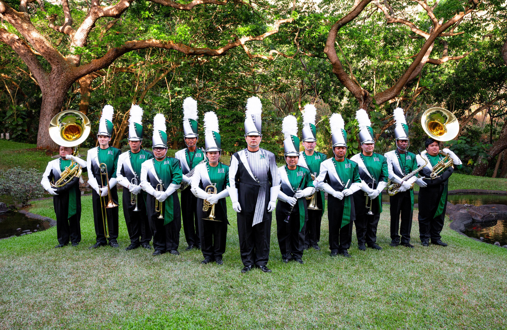

# Keeping in Step: How Marching Band Taught Me to See Design Patterns

Anyone who has ever marched in a band knows the field is chaotic before rehearsal even begins: people wandering, instruments warming up, scattered conversations-everyone is technically "there," but nothing resembles a performance yet.

Then the drum major steps onto the podium, calls the band to attention, and suddenly the noise settles into structure. Lines straighten. Movements synchronize. The once-random collection of people starts to act as if it were a single unit.

Writing software is a lot like that transformation. A codebase starts as scattered pieces: components, functions, data models, UI states. On their own, each part may work, but without coordination they don't form a cohesive performance.

That invisible structure-how individual pieces of code know where to go and how to behave-is supported by something musicians and developers share: patterns.

In marching band, patterns manifest themselves as repeating drill sets, step sizes, formations, and responsibilities across shows. Those reusable solutions are called design patterns in software.

Design patterns aren't scripts you follow blindly. They're the same sort of practiced knowledge that lets a band immediately understand what "block to wedge" means without stopping rehearsal. They give teams a shared language and a shared expectation of how things should fit together.

These patterns quietly kept our code "in step" during development of our final project, Mānoa RoomieMatch, much like drill fundamentals keep a band from collapsing into chaos on the field.

## Patterns in the Field and in the Code

Whenever you watch a marching show, you probably don't think about all the micro-patterns controlling the moves, but they're everywhere. Likewise in our software.

### Factory Pattern — Like Section Leaders Setting the Formations

In marching band, it is common for section leaders to help reset the form after water breaks.

They ensure that every clarinet starts on the correct dot, every trumpet aligns properly, and the trombones aren't drifting into the space of the flutes again.

That consistency is the reason rehearsals run smoothly.

In RoomieMatch, we needed the very same type of reliability in creating user profiles and match objects. Instead of sprinkling object creation logic in random files, we implemented a Factory approach: one spot to create consistent, validated data structures, just like section leaders ensuring everyone starts at the right place.

### Observer Pattern — The Drum Major’s Silent Communication

When the drum major gives a cutoff, nobody yells across the field.

Heads don't swivel. Everyone just knows - because everyone's watching the same source, and responding instantaneously.

React state works just like that.
Our filters, forms, and match lists kept in sync through the Observer pattern: when one piece of data changed, every component dependent on it automatically reacted. No yelling, no mayhem-just synchronized movement.

### Strategy Pattern — Selection of Different Drill Moves at Different Moments

Some drill sets call for an 8-to-5 stride.

Some need a slide-step.

Sometimes you have to back march, or jazz run, or transition into a company front.

Each move solves a different problem, but you don't redesign the entire show just because one step changes.

Our compatibility algorithm worked the same way: the different scoring approaches—personality weighting, lifestyle matching, preference penalties—acted like interchangeable "moves."

This realizes the Strategy pattern, where different algorithms can be swapped in without restructuring the system.

### MVC — The Front Ensemble, Winds, and Battery Working as One

Marching bands naturally break down into functional units:

the front ensemble provides the texture.

the battery drives time.

The winds carry melody and shape the show visually.

Our project followed that same division of labor through an MVC-like structure:

Models handled user and match data,

Views displayed the interface,

Controllers managed the logic between them.

Each system played its role, but the show only worked when they were functioning together in harmony.

## The Show Comes Together

By the time our project crossed the finish line, it was more similar to a polished halftime performance than to chaotic warm-ups we started with. The design patterns provided direction, structure, and the confidence that every piece of code knew its place-just like every marcher knows their dot.

So, when someone asks, "What are design patterns?" the answer I think of is:

They are the reusable formations and fundamentals through which a team choreographs complex behaviors without losing its synchronization.

And when they follow up with, “Which ones did you use in your final project?” the answer feels just as natural:

Factory for consistent object creation, Observer for automatic UI updates, Strategy for flexible scoring algorithms, and MVC to keep our system organized-each one a drill move that kept the whole project perfectly in step.

I had chatgpt help me thik of how to relate design patterns to marching band had had it write up some ideas for me.
