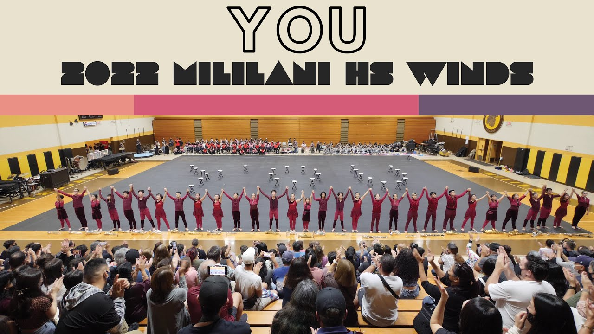

I also participated in the Mililani High School Indoor Winds program, which focused on precision and musicality in a competitive indoor setting. This experience pushed me to refine my performance skills and adapt to a more intense and detailed rehearsal and competition environment. We competed at the 2022 WGI World Championships and placed 4th as world class finalists.

Here is the show I performed in that we went to compete with: <a href="https://www.youtube.com/watch?v=Q4wWOSNgUT0"><i class="large github icon "></i>You | Miliani HS Indoor Winds | 2022 Mililani Springfest</a>
